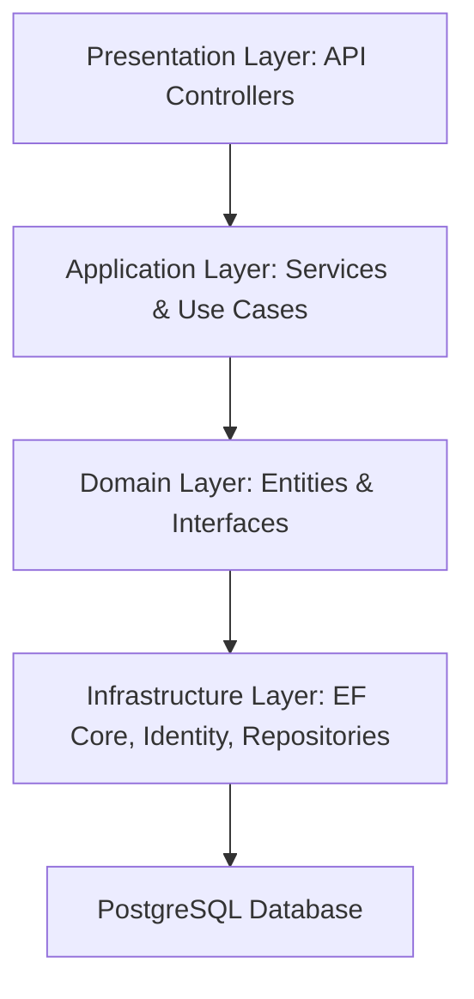

# Core Banking Solution

<<<<<<< HEAD
A modern, secure core banking API built with **.NET 10**, **Clean Architecture**, and **CQRS**. Provides customer account management, fund transfers, transaction processing, admin controls, and email notifications.
=======
[](https://dotnet.microsoft.com/) 
[](https://learn.microsoft.com/en-us/dotnet/csharp/) 
[](https://www.postgresql.org/)
[](LICENSE)

A **robust backend solution for core banking operations**, built using **ASP.NET Core 8**, **C#**, and **PostgreSQL**, while following the **Clean Architecture** principles. This project demonstrates a modular, maintainable, and secure backend system suitable for financial applications.
>>>>>>> 87766bbd60cfb8288b6b868f0703223aa4dfd0af

---

## Table of Contents

<<<<<<< HEAD
- [Architecture](#architecture)
- [Tech Stack](#tech-stack)
- [Project Structure](#project-structure)
- [Getting Started](#getting-started)
  - [Prerequisites](#prerequisites)
  - [Configuration](#configuration)
  - [Database Setup](#database-setup)
  - [Run the Application](#run-the-application)
- [API Endpoints](#api-endpoints)
  - [Authentication](#authentication)
  - [Accounts](#accounts)
  - [Transactions](#transactions)
  - [Admin](#admin)
  - [Health](#health)
- [Authentication & Authorization](#authentication--authorization)
- [Domain Model](#domain-model)
- [CQRS with MediatR](#cqrs-with-mediatr)
- [Email Notifications](#email-notifications)
- [Swagger API Docs](#swagger-api-docs)
- [Docker](#docker)
- [Migrations](#migrations)
- [Environment Variables](#environment-variables)
=======
- [Overview](#overview)
- [Project Screenshots](#project-screenshots)
- [Features](#features)  
- [Architecture](#architecture)  
- [Folder Structure](#folder-structure)  
- [Tech Stack](#tech-stack)
- [Live Link](#live-link) 
- [Installation & Setup](#installation--setup)  
- [Database Setup](#database-setup)  
- [API Documentation](#api-documentation)
- [How to Simulate Deposit & Transfer Between Accounts](#how-to-simulate-deposit--transfer-between-accounts)
- [Example Requests & Responses](#example-requests--responses)  
- [Validation & Security](#validation--security)  
- [Contributing](#contributing)  
- [License](#license)  
- [Author](#author)

---

## Overview

The **Core Banking Solution** simulates user account creation, fund transfers, deposits, withdrawals and transaction history with authentication and authorization using ASP.NET Core while following the Clean Architecture Pattern, Microservices and the Repository Pattern.

It demonstrates:

- Clean architecture separation: Domain, Application, Infrastructure, Presentation  
- Secure authentication & authorization with **ASP.NET Core Identity** and **JWT**  
- RESTful APIs 
- Automated validation pipelines and error handling  

---

## Project Screenshots

### Swagger Documentation
<p align="center">
  
  
</p>

###  Credit and Debit Alert 
<p align="center">
  
  
</p>

### 🔄 Transfer Funds (Request and Response)

<p align="center">
  
  
</p>

---

## Features

- **Customer Management:** Register, update, and retrieve customer information  
- **Bank Accounts:** Create and manage accounts per customer  
- **Transactions:** Deposit, withdrawal, transfer, and transaction history  
- **Role-based Access Control:** Admin and Customer roles  
- **Validation Pipeline:** Ensures input validation and domain rules  
- **Security:** Password hashing, JWT authentication, and claims-based authorization  
- **Logging & Auditing:** Tracks critical actions for accountability  
>>>>>>> 87766bbd60cfb8288b6b868f0703223aa4dfd0af

---

## Architecture

<<<<<<< HEAD
The solution follows **Clean Architecture** with **Domain-Driven Design** principles, structured into four layers:

```
┌─────────────────────────────────────────────┐
│         CoreBanking.Api (Presentation)      │
│   Controllers, Middleware, Swagger, Auth    │
├─────────────────────────────────────────────┤
│    CoreBanking.Application (Application)    │
│   Commands, Handlers, Services, Interfaces  │
├─────────────────────────────────────────────┤
│    CoreBanking.Infrastructure (Infrastructure) │
│   Persistence, Email, Repositories, EF Core │
├──────────────────┬──────────────────────────┤
│ CoreBanking.Domain│   CoreBanking.DTOs      │
│  (Entities, Enums)│   (Data Transfer Objects)│
└──────────────────┴──────────────────────────┘
```

**Key Patterns:**
- **CQRS** via **MediatR** — Commands and CommandHandlers for write operations
- **Repository Pattern** — Data access abstraction for accounts, transactions, and admin
- **Unit of Work** — Transactional integrity across repository operations
- **Dependency Injection** — Throughout the application using .NET's built-in DI

---

## Tech Stack

| Technology | Purpose |
|---|---|
| **.NET 10** | Runtime framework |
| **ASP.NET Core** | Web API framework |
| **Entity Framework Core 10** | ORM / data access |
| **PostgreSQL** | Database |
| **Npgsql** | PostgreSQL provider for EF Core |
| **MediatR** | CQRS command/query handling |
| **JWT Bearer** | Authentication |
| **ASP.NET Core Identity** | User management |
| **Swagger / Swashbuckle** | API documentation |
| **SendGrid** | Email delivery |
| **BCrypt.Net** | Password hashing |
| **FluentEmail** | Email composition |
| **MailKit / MimeKit** | Email handling |

---

## Project Structure

```
Core-Banking-Solution/
├── CoreBanking.Api/               # Presentation Layer
│   ├── Controllers/               # API endpoints
│   │   ├── AccountsController.cs
│   │   ├── AdminController.cs
│   │   ├── AuthController.cs
│   │   └── TransactionController.cs
│   ├── Extensions/                # Service configuration extensions
│   ├── Swagger/                   # Swagger document filters
│   ├── Program.cs                 # Application entry point
│   └── appsettings.json           # Configuration
│
├── CoreBanking.Application/       # Application Layer
│   ├── Command/                   # CQRS Commands
│   │   ├── EmailConfirmationCommand/
│   │   ├── PasswordResetCommand/
│   │   ├── RegisterCommand/
│   │   └── TransactionPinCommand/
│   ├── CommandHandlers/           # CQRS Command Handlers
│   ├── Common/                    # Shared utilities (Result, Hashing)
│   ├── Identity/                  # Role seeding, JWT settings
│   ├── Interfaces/                # Abstractions for infra
│   ├── Security/                  # Code hashing, PIN validation
│   └── Services/                  # Application services
│
├── CoreBanking.Domain/            # Domain Layer
│   ├── Entities/
│   │   ├── Customer.cs
│   │   ├── BankAccount.cs
│   │   ├── Transaction.cs
│   │   ├── EmailConfirmation.cs
│   │   └── BaseEntity.cs
│   └── Enums/
│       └── TransactionType.cs
│
├── CoreBanking.DTOs/              # Data Transfer Objects
│   ├── AccountDto/
│   └── TransactionDto/
│
├── CoreBanking.Infrastructure/    # Infrastructure Layer
│   ├── Persistence/               # DbContext
│   ├── Repository/                # EF Core Repositories
│   ├── Migrations/                # EF Core Migrations
│   ├── EmailServices/             # SendGrid integration
│   └── Services/                  # Email notification services
│
├── Dockerfile                     # Docker build
└── CoreBankingSolution.sln        # Solution file
```

---

## Getting Started

### Prerequisites

- [.NET 10 SDK](https://dotnet.microsoft.com/download/dotnet/10.0)
- [PostgreSQL](https://www.postgresql.org/) (local or remote)
- `dotnet-ef` CLI tool:
  ```bash
  dotnet tool install --global dotnet-ef
  ```

### Configuration

All settings are in `CoreBanking.Api/appsettings.json`:

```json
{
  "ConnectionStrings": {
    "DefaultConnection": "Host=localhost;Database=CoreBankingDb;Username=postgres;Password=password1234"
  },
  "JwtSettings": {
    "Key": "SuperSecretKeyForJwtTokenGeneration2024!",
    "Issuer": "CoreBanking",
    "Audience": "CoreBankingUsers",
    "DurationInMinutes": 60
  },
  "Admin": {
    "Email": "admin@corebanking.com",
    "Password": "Admin@123",
    "UserName": "admin"
  },
  "EmailConfiguration": {
    "From": "noreply@corebanking.com",
    "SendGridApiKey": ""
  }
}
```

> **Note:** Set `EmailConfiguration.SendGridApiKey` for email functionality. Without it, email features (welcome emails, transaction alerts, password reset codes) will not work.

### Database Setup

1. Ensure PostgreSQL is running locally (default: `localhost:5432`).

2. The database is automatically migrated on application startup via `context.Database.MigrateAsync()` in `Program.cs`. Alternatively, apply migrations manually:

   ```bash
   dotnet ef database update \
     --project CoreBanking.Infrastructure \
     --startup-project CoreBanking.Api
   ```

3. The application seeds an **Admin** role and a default admin user on first startup:
   - Email: `admin@corebanking.com`
   - Password: `Admin@123`

### Run the Application

```bash
dotnet run --project CoreBanking.Api
```

The API starts at:
- **HTTP:** `http://localhost:5000`
- **Swagger UI:** `http://localhost:5000/swagger`

---

## API Endpoints

### Authentication

All auth endpoints are under `POST /api/auth/`.

| Endpoint | Auth | Description |
|---|---|---|
| `POST /api/auth/customer/register` | — | Register a new customer account |
| `POST /api/auth/customer/login` | — | Login & receive JWT token |
| `POST /api/auth/confirm-email` | — | Send email confirmation code |
| `POST /api/auth/verify-email` | — | Verify email with confirmation code |
| `POST /api/auth/resend-confirmation-email` | — | Resend email confirmation code |
| `POST /api/auth/reset-password` | — | Send password reset code to email |
| `POST /api/auth/verify-password` | — | Verify reset code & set new password |
| `POST /api/auth/resend-password-reset-code` | — | Resend password reset code |
| `POST /api/auth/reset-transaction-pin` | — | Send transaction PIN reset code |
| `POST /api/auth/verify-transaction-pin` | — | Verify PIN reset code |
| `POST /api/auth/resend-transaction-pin-code` | — | Resend PIN reset code |
| `POST /api/auth/change-password` | — | Change password (requires current password) |
| `POST /api/auth/change-pin` | — | Change transaction PIN |

### Accounts

All endpoints require `[Authorize]` (JWT token).

| Method | Endpoint | Description |
|---|---|---|
| `GET` | `/api/accounts/dashboard` | Get user dashboard overview |
| `POST` | `/api/accounts/set-pin` | Set transaction PIN |
| `GET` | `/api/accounts/my-account` | Get authenticated user's accounts |
| `GET` | `/api/accounts/my-profile` | Get customer profile |
| `GET` | `/api/accounts/check-balance` | Check account balance |

### Transactions

All endpoints require `[Authorize]` (JWT token).

| Method | Endpoint | Description |
|---|---|---|
| `POST` | `/api/transaction/transfer-funds` | Transfer funds between accounts |
| `GET` | `/api/transaction/transaction-history` | Get user's transaction history |
| `POST` | `/api/transaction/withdraw` | Withdraw funds from account |

### Admin

| Method | Endpoint | Auth | Description |
|---|---|---|---|
| `GET` | `/api/admin/get-all-customers` | — | Get all customers |
| `GET` | `/api/admin/get-all-frozen-accounts` | — | Get all frozen accounts |
| `GET` | `/api/admin/get-customerinfo-by-email` | — | Get customer info by email |
| `GET` | `/api/admin/total-customers` | — | Total customer count |
| `GET` | `/api/admin/total-active-customers` | — | Total active customers |
| `GET` | `/api/admin/total-inactive-customers` | — | Total inactive customers |
| `POST` | `/api/admin/deposit` | Admin | Deposit funds into any account |
| `PUT` | `/api/admin/update-account` | — | Update customer profile |
| `DELETE` | `/api/admin/delete-account` | — | Delete customer account |
| `POST` | `/api/admin/freeze-account` | — | Freeze an account |
| `POST` | `/api/admin/unfreeze-account` | — | Unfreeze an account |
| `POST` | `/api/admin/deactivate-account` | — | Deactivate an account |
| `POST` | `/api/admin/reactivate-account` | — | Reactivate an account |

> **Note:** Most admin endpoints allow open access in the current configuration. The `[Authorize(Roles = "Admin")]` attribute is applied only to the deposit endpoint. For production, apply role-based authorization to all admin endpoints.

### Health

| Method | Endpoint | Description |
|---|---|---|
| `GET` | `/` | Simple health check — returns "Core Banking API is running" |
| `GET` | `/health` | Health check with status and timestamp |

---

## Authentication & Authorization

**Authentication** uses **JWT Bearer Tokens**:
- Default scheme: `Bearer`
- Tokens contain role claims (`ClaimTypes.Role`) for authorization
- Token expiry: configurable (default 60 minutes)

**Identity** uses **ASP.NET Core Identity** with `Customer` as the custom user class (extends `IdentityUser`), backed by the same PostgreSQL database.

**On Startup:**
1. Database is auto-migrated
2. **Admin** role is created if it doesn't exist
3. A default admin user is seeded with credentials from configuration

---

## Domain Model

```
Customer (IdentityUser)
├── FirstName, LastName, PhoneNumber
├── TransactionPin (hashed), PinSalt
├── IsFrozen, FrozenDate, IsActive
└── BankAccount (1:1)

BankAccount
├── AccountNumber, AccountType
├── Balance, Currency (default: NGN)
├── Status (default: PendingApproval)
├── TransactionPin (int?)
├── CustomerId (FK → Customer)
└── Transactions (1:N)

Transaction
├── Reference, Amount, Type (enum)
├── Description, CreatedAt
├── BankAccountId (FK → BankAccount)
└── UserId (FK → Customer)

EmailConfirmation
├── UserId, Email, CodeHash, Salt
├── Purpose, IsUsed
├── CreatedAt, ExpiresAt
```

---

## CQRS with MediatR

Write operations are handled through **MediatR Commands and CommandHandlers**:

```
RegisterCommand → RegisterCommandHandler
  ├── Creates customer account via UserManager
  ├── Creates bank account
  ├── Sends welcome email
  └── Sends email confirmation code

SendEmailCodeCommand → SendEmailCodeHandler
VerifyEmailCodeCommand → VerifyEmailCodeHandler
ChangePasswordCommand → ChangePasswordHandler
ChangePinCommand → ChangePinHandler
...and more
```

---

## Email Notifications

Email is sent via **SendGrid API**. The following events trigger emails:

| Event | Template | Sent To |
|---|---|---|
| Registration | WelcomeTemplate.html | New customer |
| Email confirmation | Inline code | Customer email |
| Password reset | Inline code | Customer email |
| PIN reset | Inline code | Customer email |
| Fund transfer (debit) | TransactionAlert.html | Sender |
| Fund transfer (credit) | TransactionAlert.html | Receiver |
| Admin deposit | TransactionAlert.html | Customer |
| Withdrawal | TransactionAlert.html | Customer |

> Configure `EmailConfiguration.SendGridApiKey` in `appsettings.json` to enable email sending.

---

## Swagger API Docs

Swagger UI is available at `/swagger` when the application is running.

**Features:**
- Bearer token authentication via "Authorize" button
- Built-in Identity endpoints (`/api/auth/register`, `/api/auth/login`, etc.) are hidden from Swagger via a custom document filter

---

## Docker

A multi-stage Dockerfile is provided:

```bash
# Build image
docker build -t core-banking-api .

# Run container
docker run -p 5000:8080 \
  -e ConnectionStrings__DefaultConnection="Host=host.docker.internal;Database=CoreBankingDb;Username=postgres;Password=password1234" \
  core-banking-api
```

> **Note:** The Dockerfile currently targets `mcr.microsoft.com/dotnet/aspnet:8.0`, but the project targets `net10.0`. Update the base images to `mcr.microsoft.com/dotnet/aspnet:10.0` and `mcr.microsoft.com/dotnet/sdk:10.0` for compatibility.

---

## Migrations

This project uses **Entity Framework Core Code-First Migrations**.

**Create a new migration:**
```bash
dotnet ef migrations add MigrationName \
  --project CoreBanking.Infrastructure \
  --startup-project CoreBanking.Api
```

**Apply pending migrations:**
```bash
dotnet ef database update \
  --project CoreBanking.Infrastructure \
  --startup-project CoreBanking.Api
```

**Remove the last migration:**
```bash
dotnet ef migrations remove \
  --project CoreBanking.Infrastructure \
  --startup-project CoreBanking.Api
```

**Generate a SQL script:**
```bash
dotnet ef migrations script --idempotent \
  --project CoreBanking.Infrastructure \
  --startup-project CoreBanking.Api
```

Migrations are also applied automatically on application startup via `Program.cs`.

---

## Environment Variables

| Variable | Description | Default |
|---|---|---|
| `ConnectionStrings__DefaultConnection` | PostgreSQL connection string | From `appsettings.json` |
| `EmailConfiguration__SendGridApiKey` | SendGrid API key for email | (empty) |
| `JwtSettings__Key` | JWT signing key | From `appsettings.json` |
| `ASPNETCORE_ENVIRONMENT` | Runtime environment | `Development` |

Override any `appsettings.json` value with environment variables using the `__` (double underscore) separator convention (e.g., `JwtSettings__DurationInMinutes`).

---

## License

This project is proprietary and confidential.
=======

---

## Folder Structure
```
CoreBankingSolution/
│
├─ src/
│   ├─ CoreBanking.Domain/           # Entities, Interfaces, Value Objects
│   ├─ CoreBanking.DTO/              # DTOs
│   ├─ CoreBanking.Application/      # Services, Use Cases, CQRS
│   ├─ CoreBanking.Infrastructure/   # EF Core, Repositories, Identity
│   └─ CoreBanking.API/              # Controllers, Program.cs
│
├─ docker/                           # Docker configurations 
└─ README.md
```
---

## Tech Stack
```
• .NET Core (C#)
• Entity Framework Core
• PostgreSQL
• ASP.NET Identity
• JWT Authentication
• Clean Architecture
• Repository Pattern & Dependency Injection
• Command Query Responsibility Segregation (CQRS)
• Unit of Work & Database Transactions
• SendGrid SMTP (for email services) 
```

## Live Link
• Live Link (Swagger Docs): https://core-banking-solution.onrender.com/swagger/index.html <br>

## Installation & Setup

### Prerequisites
Before you begin, make sure you have the following installed:

- [.NET 8 SDK](https://dotnet.microsoft.com/en-us/download/dotnet/8.0)  
- [PostgreSQL](https://www.postgresql.org/download/)  
- [Git](https://git-scm.com/downloads)  

---

### Steps

1. **Clone the repository**

```bash
git clone https://github.com/Yamuhammad01/Core-Banking-Solution.git
```
2. **Restore dependencies**
```bash
dotnet restore

```
2. **Create database migration**
```bash
Add-Migration "InitialCreate"
```
3. **Update Database**
```bash
Update-Database
```
3. **Run the API**
```bash
dotnet run
```
4. **Access API at https://localhost:yourport**

---

## Database Setup
```
• Database: CoreBankingDB
• Tables: AspNetUsers, AspNetUserTokens, AspNetUserRoles, AspNetUserLogins, AspNetUserClaims, AspNetRoles, AspNetRoleClaims, Accounts, Transactions, ConfirmationCodes

```
---
## API Documentation

This section documents all the main endpoints of the Core Banking API, including sample requests, responses, and expected HTTP status codes.

---

### **Endpoints Overview**

| Endpoint                      | Method | Description                     | Status Codes |
|-------------------------------|--------|---------------------------------|--------------|
| `/api/admin/get-all-customers`             | GET    | Get all customers               | 200 OK      |
| `/api/admin/get-customers-by-email`        | GET    | Get customer by Email             | 200 OK, 404 Not Found |
| `/api/admin/deposit`  | POST   | Deposit into an account         | 200 OK, 400 Bad Request |
| `/api/auth/customers/register`             | POST   | Register a new customer           | 201 Created, 400 Bad Request |
| `/api/customer/auth/login`            | POST   | User login & JWT generation     | 200 OK, 400 Bad Request, 401 Unauthorized |
| `/api/transactions/withdraw` | POST   | Withdraw from an account        | 200 OK, 400 Bad Request, 403 Forbidden |
| `/api/transactions/transfer-funds` | POST   | Transfer between accounts       | 200 OK, 400 Bad Request, 403 Forbidden |
| `/api/transactions/transaction-history` | GET   | View transaction history       | 200 OK, 400 Bad Request, 403 Forbidden |


---

## How to Simulate Deposit & Transfer Between Accounts

This section explains how to test **deposit** and **transfer** operations inside the Core Banking Solution using the built-in simulation endpoints. These endpoints are strictly for **development and testing purposes**.

##  Deposit Simulation
### **1. Register a New Customer**
- Submit a registration request.
-  A unique **account number** is automatically generated.
-  Account details are sent to the registered email  
  *(check Spam/Junk if not found)*.

### **2. Log In as Admin**
Use the built-in admin credentials: <br>
• Email: admin@corebanking.com <br>
• Password: Admin@123@$ <br>

After login, a **JWT token** is generated.

### **3. Copy the Token**
Add it to your request (authorisation) header:
Authorization: Bearer <YOUR_JWT_TOKEN> 

### **4. Make a Deposit Request**
Call the `/api/admin/deposit` endpoint using the account number of the customer you registered.

### **5. Check Email Notification**
A **credit alert** is sent to the customer's email showing:
- Amount deposited  
- Updated balance  
- Transaction details  

### **6. Log In as the Customer**
- Use the customer’s email and password. <br>
- copy the generated token and add it to the authorisation header in this format (Bearer eyJhbGciOiJIUzI......)


### **7. Access Account Endpoints**
You can now view:
- Account balance  
- My account  
- Profile information  
- Transaction history  e.t.c
  
  
  ## 🔄 Transfer Between Accounts Simulation

### **1. Create a Second Account**
Register another customer with a different email to generate a second account.

### **2. Initiate a Transfer**
- Log in to the account with funds (Account A).  
- Send a transfer request from **Account A → Account B** using `/api/transactions/transfer-funds`.

### **3. Check Email Alerts**
- **Account A** receives a debit alert.  
- **Account B** receives a credit alert.  

### **4. View Transaction History**
Use the transaction history endpoint to confirm:
- Deposits  
- Transfers  
- Withdrawals  

---

## Important Note

The **deposit endpoint is available only for simulation/testing purposes only**.

In a real-world core banking system:
- Admin deposits should **not exist**  
- Funds should only be added through external bank integrations or real payment rails
- Deposits usually come via ACH, SWIFT, NIP, card transactions, or bank APIs, not through admin-triggered actions.

This simulation exists solely for testing account workflows during development.
 
### **Example Requests & Responses**

#### **1. User Login**

**POST** `/api/auth/login`  
**Headers:**
```http
Content-Type: application/json
{
  "email": "user@example.com",
  "password": "Password123!"
}
```
### **Responses**
```http
Content-Type: application/json
{
  "token": "<JWT_TOKEN>",
  "expiresIn": 3600
}
```
---
## Validation & Security
```
• Passwords hashed using ASP.NET Core Identity
• JWT Authentication & Role-based Authorization

```
---
## Contributing

• Fork the repository  <br>
• Create a feature branch: git checkout -b feature/XYZ..Feature <br>
• Commit your changes: git commit -m "Added xyz... feature" <br>
• Push to branch: git push origin feature/XYZ..Feature <br>
• Open a Pull Request <br>

---
## License

This project is licensed under the MIT License.

---
## Author
Muhammad Idris

• GitHub: https://github.com/Yamuhammad01 <br>
• LinkedIn: https://www.linkedin.com/in/muhammad-idrisb2/ <br>
• Email: idrismuhd814@gmail.com <br>

---
>>>>>>> 87766bbd60cfb8288b6b868f0703223aa4dfd0af
